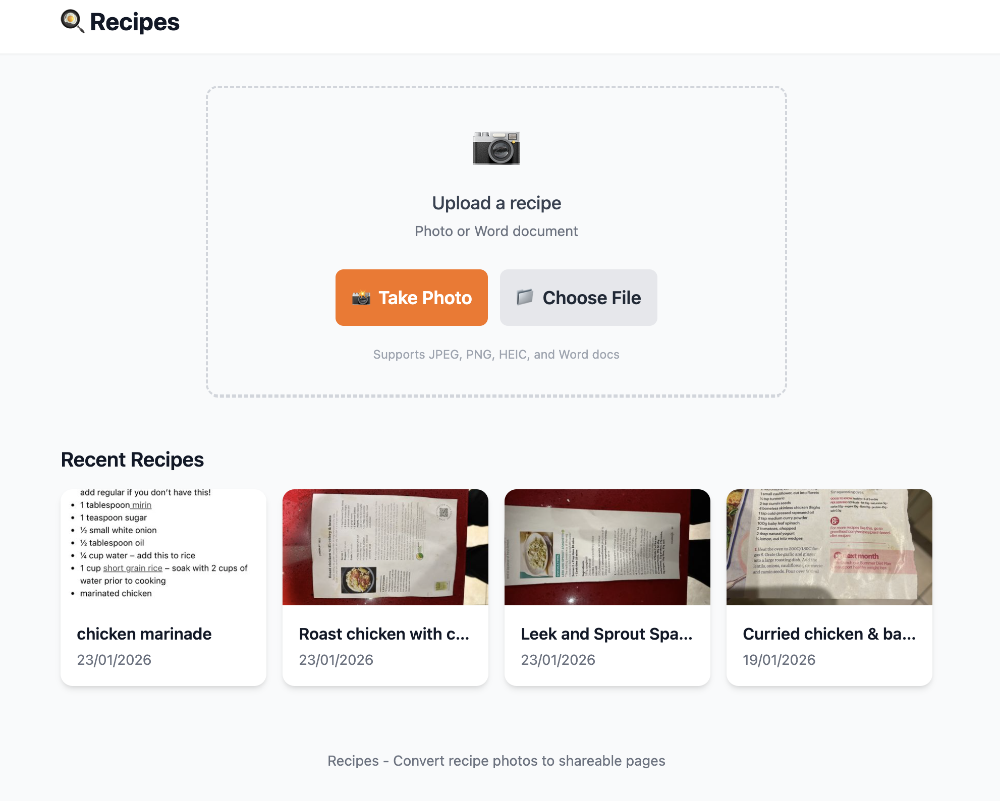

# Recipes

Recipes is a small full-stack app for turning recipe photos and Word documents into clean, shareable recipe pages. Upload a snapshot of a handwritten or printed recipe, let the backend extract the structure with OpenAI, and the app stores the result in PostgreSQL with a public page and downloadable QR code.



## What It Does

- Upload recipe images or Word documents from desktop or mobile.
- Extract the recipe title, description, ingredients, instructions, and extra metadata with OpenAI.
- Store recipes in PostgreSQL with generated slugs.
- Create a dedicated shareable page for each recipe.
- Generate QR codes for easy printing or sharing.
- Keep the original upload alongside the parsed recipe output.

## Stack

- Frontend: React, Vite, Tailwind CSS
- Backend: Node.js, Express
- AI extraction: OpenAI API
- Database: PostgreSQL
- File processing: Multer, Sharp, Mammoth, `heif-convert`

## Project Structure

```text
.
├── frontend/   # React client
├── backend/    # Express API and database access
└── docs/assets # README assets
```

## Requirements

- Node.js 20+
- npm
- PostgreSQL
- An OpenAI API key
- `heif-convert` available on your machine if you want reliable HEIC/HEIF support

## Installation

1. Clone the repository:

   ```bash
   git clone git@github.com:3vilM33pl3/recipes.git
   cd recipes
   ```

2. Install dependencies for both apps:

   ```bash
   cd backend && npm install
   cd ../frontend && npm install
   cd ..
   ```

3. Create a PostgreSQL database:

   ```bash
   createdb recipes
   ```

4. Create your environment file:

   ```bash
   cp .env.example .env
   ```

5. Update `.env` with at least:

   ```env
   NODE_ENV=development
   PORT=3000
   BASE_URL=http://localhost:3000
   DATABASE_URL=postgresql://localhost/recipes
   OPENAI_API_KEY=your_api_key_here
   OPENAI_MODEL=gpt-5.2
   ```

6. Start the backend:

   ```bash
   cd backend
   npm run dev
   ```

7. In a second terminal, start the frontend:

   ```bash
   cd frontend
   npm run dev
   ```

8. Open `http://localhost:5173`.

The backend creates the database schema automatically on startup. In local development, Vite proxies `/api`, `/uploads`, `/thumbnails`, and `/qrcodes` to `http://localhost:3000`.

## Environment Variables

| Variable | Required | Description |
| --- | --- | --- |
| `NODE_ENV` | No | App environment, defaults to `development`. |
| `PORT` | No | Backend port, defaults to `3000`. |
| `BASE_URL` | Yes | Public base URL used in share links and QR codes. |
| `DATABASE_URL` | Yes | PostgreSQL connection string. |
| `OPENAI_API_KEY` | Yes | API key used for recipe extraction. |
| `OPENAI_MODEL` | No | OpenAI model name, defaults to `gpt-5.2`. |
| `UPLOAD_DIR` | No | Directory for uploaded originals. |
| `THUMBNAIL_DIR` | No | Directory for generated thumbnails. |
| `QRCODE_DIR` | No | Directory for QR code images. |
| `MAX_FILE_SIZE` | No | Maximum upload size in bytes. |
| `ALLOWED_TYPES` | No | Comma-separated MIME types accepted by upload validation. |

## How It Works

1. The frontend uploads an image or document to the Express API.
2. The backend reads Word files with Mammoth or sends images to OpenAI for extraction.
3. The parsed recipe is normalized and saved to PostgreSQL.
4. A slugged recipe page is created at `/r/:slug`.
5. A QR code is generated in the background for sharing the recipe page.

## Production

The repository includes a `Dockerfile` that builds the frontend, installs the backend, and serves the compiled app from the Express server on port `3000`.

## License

No license file is currently included in this repository.
